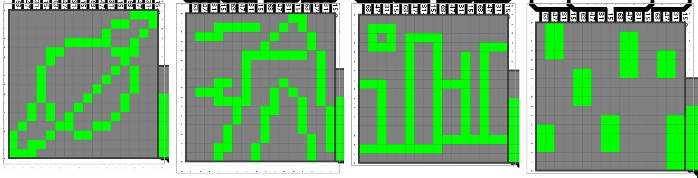

# Monitor Simulator

`MUX/DeMUX`와 를 이용하여 모니터를 선택하여 채널을 바꾸고 `Register`를 이용하여 볼륨을 조절하는 것을 `Logisim`의 `LedMatrix`로 시각적으로 시뮬레이션 한 프로젝트이다. 

## 동영상

https://www.youtube.com/embed/QNlzW9RMW54

## 기능

### 컨트롤러

모든 조작을 시행하는 버튼들의 모음

- MonitorSelector: 모니터 선택
- ChSelector: 채널 선택
- Ach: 전체 모니터 선택
- Up/Down: 볼륨 조절

### 채널 조작

`ChSelector` 버튼을 이용해 4개의 채널을 순서대로 전환 가능

### 모니터 선택

`MonitorSelector` 버튼을 이용하여 4개의 모니터를 순서대로 전환 가능

`Ach` 비트가 `On(1)`일 경우 모든 모니터에 같은 채널 입력 

### 볼륨 조작

`VolumeController`의 `Up/Down` 버튼을 이용해 현 모니터의 볼륨을 조절 가능

`Ach` 비트가 `On(1)`일 경우 모든 모니터의 볼륨 동시 컨트롤 가능

